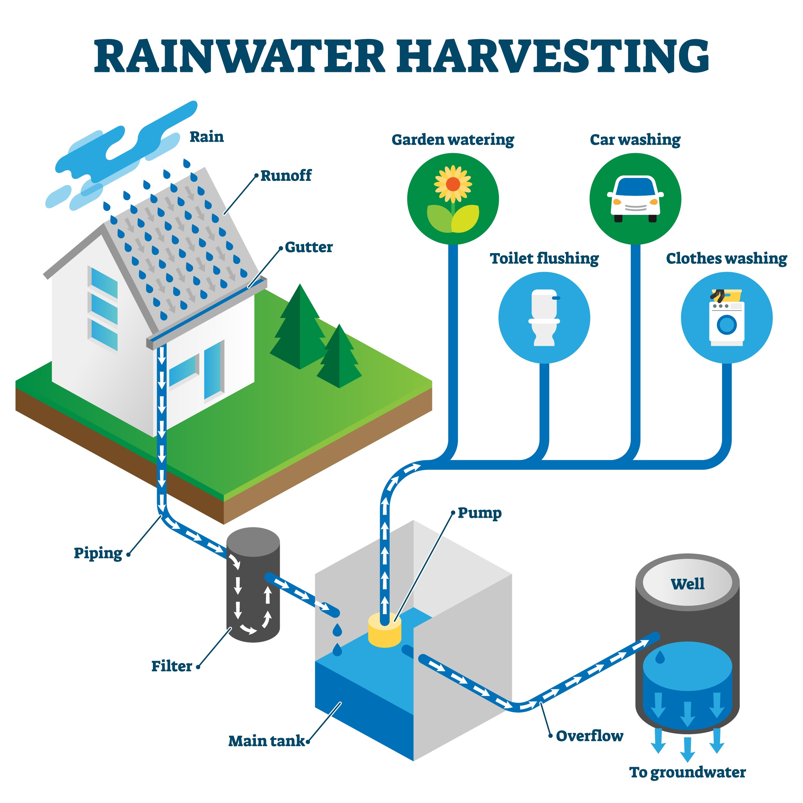

## 1. Identifikasi Masalah: Urgensi Krisis Air dan Sanitasi Global

Masalah air bersih bukan sekadar isu lingkungan, melainkan fondasi utama bagi martabat dan kelangsungan hidup manusia. Berdasarkan data global terbaru, saat ini terdapat sekitar 2 miliar orang atau setara dengan 26% populasi dunia yang masih belum memiliki akses terhadap air minum yang dikelola secara aman. Kondisi sanitasi jauh lebih memprihatinkan, di mana sekitar 3,6 miliar orang atau 46% penduduk bumi hidup tanpa fasilitas pembuangan limbah yang layak.

Sebagai mahasiswa Sistem dan Teknologi Informasi, saya melihat fenomena ini bukan sekadar kekeringan fisik, melainkan sebuah krisis manajemen sumber daya dan kegagalan dalam sistem distribusi informasi. Ketimpangan akses ini menciptakan lingkaran setan kemiskinan dan penyakit yang menghambat potensi ekonomi miliaran manusia. Setiap tahunnya, lebih dari 297.000 anak balita meninggal dunia akibat penyakit diare yang sebenarnya bisa dicegah jika sanitasi dan kualitas air terjaga. Tanpa adanya intervensi rekayasa sistem yang cerdas, target global untuk menyediakan air bersih bagi semua orang pada tahun 2030 akan sangat sulit tercapai karena tren saat ini menunjukkan adanya stagnasi dalam progres pembangunan infrastruktur dasar.

---

## 2. My Concepts: Arsitektur Sinergi Tiga Pilar (Hati, Pikiran, dan Tenaga)

Untuk menjawab tantangan tersebut, konsep "Mahakarya Rekayasa" yang saya tawarkan bukanlah sebuah perangkat teknis yang berdiri sendiri, melainkan sebuah sistem sosio-teknis terpadu yang menyatukan potensi manusia dan teknologi melalui pendekatan Kecerdasan Tripartit.

### A. Hati (Kecerdasan Empati dan Etika Kolektif)
Dalam arsitektur ini, "Hati" mewakili landasan moral atau Kecerdasan Aksiologis. Dalam konteks krisis air, pilar ini sangat bergantung pada keberhasilan Komunikasi Interpersonal dan Publik. Seringkali, krisis air terjadi bukan karena kelangkaan sumber daya, melainkan karena buruknya komunikasi antara pengambil kebijakan dan masyarakat terdampak, yang menyebabkan distribusi menjadi tidak adil.

Melalui komunikasi yang efektif, kita menyelaraskan pemahaman kolektif bahwa air adalah hak asasi manusia, bukan sekadar komoditas komersial. "Hati" berfungsi sebagai kompas etis untuk memastikan bahwa inovasi teknologi yang kita kembangkan bersifat inklusif. Hal ini bertujuan agar masyarakat di daerah terpencil atau kelompok rentan tidak tertinggal oleh kemajuan digital. Tanpa keberpihakan moral ini, solusi teknologi secanggih apa pun hanya akan memperlebar jurang ketimpangan sosial.

### B. Pikiran (Kecerdasan Digital dan Kolaborasi Manusia-AI)
Pilar "Pikiran" merupakan instrumen teknis yang kita gunakan untuk memproses data mentah menjadi solusi yang dapat dieksekusi. Di era kecerdasan buatan, kita tidak lagi bekerja dalam isolasi. Artificial Intelligence (AI) berperan sebagai mitra cerdas yang mampu menganalisis pola konsumsi air secara masif, mendeteksi kebocoran pada jaringan pipa secara real-time, hingga memprediksi ketersediaan air tanah berdasarkan data cuaca ekstrem.

Sebagai mahasiswa STI, saya memandang teknologi informasi sebagai pengelola kompleksitas yang membantu manusia mengambil keputusan secara lebih logis dan akurat. Mengingat lebih dari 50% populasi dunia berisiko mengonsumsi air yang terkontaminasi, sinergi antara logika manusia dan kecepatan pemrosesan AI menjadi mesin utama dalam menggerakkan sistem distribusi air yang cerdas. Pikiran inilah yang mengorkestrasi alur kerja sistem agar setiap tetes air dapat dilacak kualitas dan distribusinya secara transparan.

### C. Tenaga (Kecerdasan Sumber Daya dan Manajemen Energi)
Pilar terakhir, "Tenaga", mencakup pengelolaan energi fisik dari 8 miliar penduduk bumi serta energi fundamental dari alam. Tantangan perubahan iklim yang membuat 45% populasi dunia tinggal di wilayah rentan memaksa kita untuk mengelola "Human Energon" (kreativitas dan kolaborasi) serta energi planet secara lebih bijaksana.

Mahakarya ini memastikan bahwa setiap solusi yang kita bangun tidak menciptakan masalah lingkungan baru. Melalui sistem manajemen yang berkelanjutan, kita memastikan bahwa energi yang digunakan untuk pengolahan air bersih memberikan nilai manfaat yang sebanding bagi masyarakat tanpa merusak ekosistem. Teknologi digunakan untuk memantau siklus air secara holistik, memastikan bahwa penggunaan sumber daya selaras dengan prinsip keberlanjutan demi menjaga keseimbangan alam yang menjadi penopang hidup kita.

---

## 3. Kesimpulan: Mewujudkan Mahakarya Melalui Kolaborasi Global

Mahakarya Rekayasa Sistem di era digital ini bukanlah sebuah "super-teknologi" yang bekerja secara ajaib, melainkan sebuah ekosistem global yang berfungsi sebagai platform komunikasi publik. Sistem ini memungkinkan 8 miliar manusia untuk menyelaraskan Hati (etika), memperkuat Pikiran (teknologi cerdas), dan mengelola Tenaga (sumber daya) secara bijaksana.

Dengan mengintegrasikan teknologi informasi ke dalam pemenuhan kebutuhan dasar manusia, kita dapat mengubah krisis air menjadi harmoni kehidupan yang berkelanjutan. Inilah kontribusi nyata bidang Sistem Informasi: menjembatani kesenjangan antara potensi teknologi dan kebutuhan nyata umat manusia demi masa depan yang lebih adil dan sejahtera bagi semua.