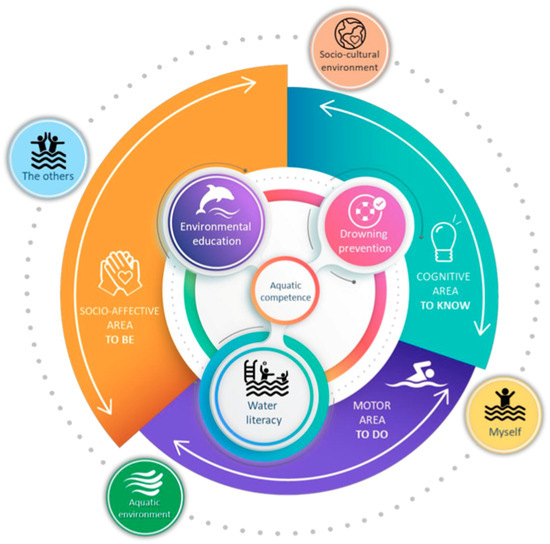

{width=90% fig-align="center"}

## 1. Strategi Mengatasi Paradoks Belajar di Era Kecerdasan Buatan

Metode belajar konvensional seringkali gagal ketika berhadapan dengan sistem TISE yang kompleks untuk solusi krisis air global. Masalah utamanya adalah paradoks pendidikan: bagaimana kita memanfaatkan asisten digital yang sangat pintar seperti AI tanpa membuat kemampuan berpikir mahasiswa menjadi tumpul. Jika mahasiswa hanya mengandalkan jawaban instan dari mesin, maka esensi belajar sebagai calon rekayasawan akan hilang karena tidak ada proses penguasaan materi yang mendalam.

Untuk menyelesaikan tantangan ini, saya mengusulkan **Aqua Literacy Framework**. Ini adalah metodologi pembelajaran yang dirancang agar mahasiswa tetap memegang otoritas penuh atas logika mereka. Fokus utamanya adalah memastikan teknologi berfungsi sebagai pemantik diskusi, bukan sebagai pemberi jawaban tunggal.

---

## 2. Implementasi Kurikulum Melalui Struktur Peta ASTF

Strategi ini memandu mahasiswa dalam mengarungi lautan informasi melalui kerangka arsitektur ASTF yang terukur dan sistematis.

### Peta Pengetahuan pada Level Dasar dan Teknologi
Pada tahap ini, mahasiswa tidak langsung membangun aplikasi. Mereka harus memetakan pemahaman di lapisan Fundamental dan Teknologi. Hal ini mencakup penguasaan prinsip fisika mengenai energi air serta pemahaman mendalam tentang bagaimana teknologi sensor bekerja mengolah data kualitas air. Tanpa fondasi ini, seorang rekayasawan hanya akan menjadi pengguna alat tanpa memahami esensi di balik alat tersebut.

### Peta Aplikasi pada Level Sistem dan Lingkungan
Setelah memahami teori dasar, mahasiswa bergerak menuju lapisan Sistem dan Aplikasi. Di sini, mereka merancang solusi nyata yang memiliki nilai guna bagi masyarakat luas. Mereka harus mampu mengintegrasikan pengetahuan teknis ke dalam sebuah ekosistem yang berkelanjutan untuk menjawab tantangan ketersediaan air di lapangan.

---

## 3. Mekanisme Validasi Menggunakan W-Model dan Bukti PICOC

Proses transformasi pengetahuan ini mengikuti alur **W-Model** yang bersifat dinamis. Mahasiswa memulai perjalanan dari pemahaman masalah di tingkat aplikasi, lalu turun ke bawah untuk melakukan riset fundamental yang mendalam, kemudian naik kembali untuk mewujudkan solusi teknis yang handal.

Sebagai bukti penguasaan materi, mahasiswa diwajibkan menyusun **Rantai Bukti PICOC Berlapis**. Setiap langkah dalam pengembangan sistem air harus memiliki bukti validasi yang jelas pada tiap lapisan arsitektur. Mulai dari pembuktian efisiensi teknologi filtrasi hingga kepuasan pengguna akhir terhadap kemudahan akses informasi air yang diberikan.

---

## 4. Memperkuat Agensi Melalui Interaksi Digital yang Reflektif

Poin paling krusial dalam metodologi ini adalah pengaturan Agen PUDAL yang memiliki batasan etis. Dalam sistem manajemen air ini, asisten digital dilarang untuk memberikan solusi teknis secara cuma-cuma kepada mahasiswa.

Tujuannya adalah untuk mendorong pemberdayaan manusia di atas pemberdayaan mesin. Ketika mahasiswa menemui hambatan dalam merancang sistem, agen digital akan merespons dengan pertanyaan reflektif yang memancing penalaran mandiri. Strategi ini memaksa mahasiswa untuk menggali potensi diri dan mengambil keputusan berdasarkan analisis mereka sendiri. Dengan demikian, mahasiswa tumbuh menjadi sosok yang memiliki agensi pribadi dan mampu menjadi penulis utama dari kisah sukses penyelesaian masalah kemanusiaan yang mereka kerjakan.